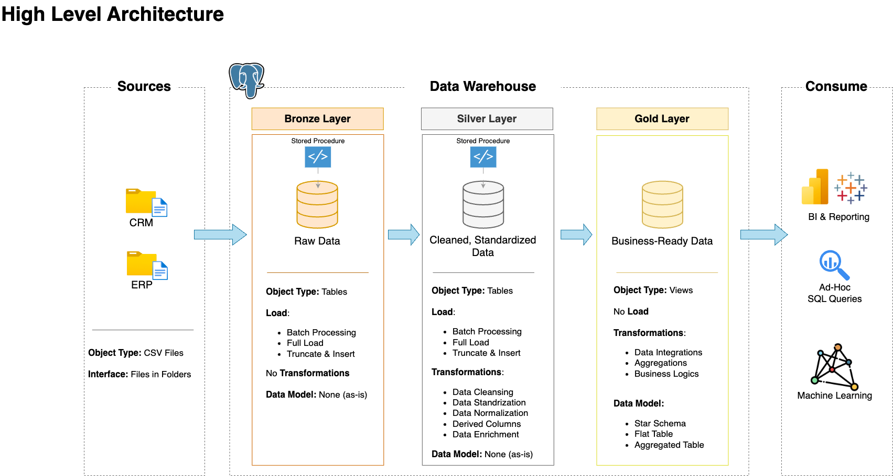

# Project - Build a data warehouse using sql
Build a modern data warehouse with postgresql/snowflake/duckDB, including ETL processes, data modelling, and analytics.


*Source: [Data With Baraa](https://datawithbaraa.substack.com/p/build-a-data-warehouse-from-scratch)*

## Prerequisites and Setup

We use Ubuntu 20.04 LTS AWS EC2 and GCP machine for the project.

We need the following:
- [git version >= 2.37.1](https://github.com/git-guides/install-git),
- [Docker version >= 20.10.17](https://docs.docker.com/engine/install/) and [Docker compose v2 version >= v2.10.2](https://docs.docker.com/compose/install/),
- [make](https://linuxhint.com/install-make-ubuntu/)

To make things easier I have scripted these prerequisites. Just clone my repo and run the instructions I provide.

```{.bash filename="clone and install prerequisites"}
sudo apt update && sudo apt install git make -y
git clone https://github.com/deepakramani/sql-data-warehouse-project.git
cd sql-data-warehouse-project
make install_docker
source ~/.bashrc
```
Logout and log in back to the instance. To test docker if it is working, run

```{.bash filename="check if docker is installed"}
docker run --rm hello-world # should return "Hello from Docker!" without errors
```

**Set environment variables**:
```{.bash filename="Setting env variables"}
export POSTGRES_USER=postgres
export POSTGRES_PASSWORD=postgres
export POSTGRES_HOST=postgres
export POSTGRES_DB=sql_dwh_db
```

Now we're ready to start our project.
```{.bash filename="Start ETL DWH project"}
cd ~/sql-data-warehouse-project
make up # creates the database and schemas for the medallion architecture
```

# Extract-Transform-Load(ETL) Process
We begin the ETL process of the data pipeline with the bronze layer. This layer is usually called `staging` layer as the raw data from various sources are dumped into temp tables. We choose `full-extract` type instead of `incremental` here. Raw data are in `csv` files.

## Bronze Layer

### Setup bronze layer and populate raw data to tables
```{.bash filename="setup bronze layer of ETL process"}
cd ~/sql-data-warehouse-project
make setup_bronze_tables
make populate_bronze_tables
```
Now the bronze layer tables have raw data populated.

## Silver Layer

### Setup silver layer table
(The script is designed to work only once in the beginning since gold layer table(downstream) is dependent on silver tables)
```{.bash filename="setup silver layer tables"}
cd ~/sql-data-warehouse-project
make setup_silver_tables
```

In the Silver layer, data cleansing and transformation on the bronze layer tables are carried out. 

### Data Cleansing
This step includes -
1. Remove duplicate entries
2. data filtering
3. handling missing/invalid data
4. handling unwanted white spaces
5. data type casting
6. outlier detection

### Data Transformation
This step includes - 
1. Data enrichment
2. data integration
3. deriving new columns
4. data aggregations
5. applying busiess rules and logic
6. data normalisation and standardisation

### Populate Silver layer tables
```{.bash filename="Populate silver layer tables"}
cd ~/sql-data-warehouse-project
make populate_silver_tables
```
As the above data integration image indicates, we design the silver t

## Gold Layer(Business Logic layer)

We use the below image to see how data from the source comes downstream to the destination in gold layer views.


*Source: [Data with Barra](https://datawithbaraa.substack.com/p/build-a-data-warehouse-from-scratch)*


Before the dimensional and fact tables are created, it is important to know the relationship between tables. The below data integration image shows how one table is related to other. This diagram helps in making joins with other tables using that specific key.


```{.bash filename="Create gold layer views"}
cd ~/sql-data-warehouse-project
make setup_gold_layer
```
## Data Mart
In the image below, we can see how the gold layer dimensional and fact tables/views(data marts) are created.


# Testing - Data quality checks

Testing data quality is an integral part of ETL process. It ensures bad data doesn't get transmitted to the stakeholders or business users potentially avoiding dire consequences.

Here we check data integrity, consistency, and correctness. 
It verifies primary key uniqueness, standardization, referential integrity, 
and logical correctness of business rules.

### Silver - data quality check
```{.bash filename="Silver data quality checks"}
cd ~/sql-data-warehouse-project
make check_silver_data_quality
```

## Gold - data quality check

```{.bash filename="Gold data quality checks"}
cd ~/sql-data-warehouse-project
make check_gold_data_quality
```

# Data Catalog
Gold layer views are usually used by Business users. In order to help them understand what each row in the table/view represent is important. Therefore I provide a catalog file that gives the metadata of the views created.

[Data Catalog](./assets/data_catalog.md)

## Future developments
1. Take historical data into account
2. Do incremental data load than full load each time
3. Make use of an orchestration tool such as Dagster to orchestrate ETL process
4. Do EDA on the gold layer and derive reports for business users


### Deleting resources
To bring down all container and return to the original state, run the following instructions

```{.bash filename="restoring to original state"}
make down
```
